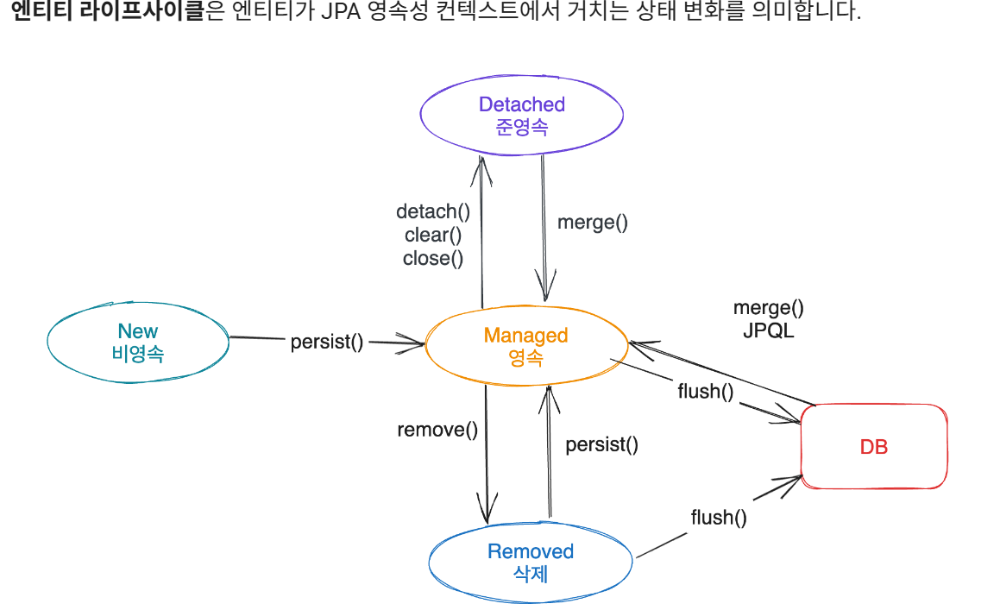
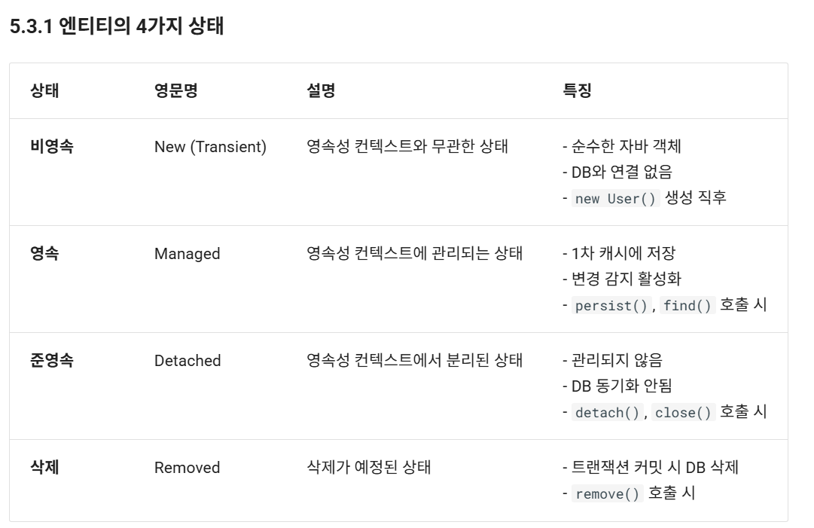

### 오늘 배운 내용 중 가장 기억에 남는 것
    JPA가 가장 기억에 남는다. 
    JPA란
-   JPA는 자바 객체(객체지향)와 관계형 데이터베이스(RDB)를 연결시켜주는 표준 인터페이스다.
    즉, DB를 SQL로 직접 다루는 대신, 엔티티(자바 객체)를 통해 저장/조회/갱신/삭제를 하게 해주는 존재다.
    
- JPA에서는 핵심 개념이 존재하는데, 그 중 일부를 정리하자면 다음과 같다.
1. Entity(엔티티): DB 테이블과 매핑되는 자바 클래스. @Entity 붙여 사용.
2. Persistence Context(영속성 컨텍스트): 엔티티 객체를 관리하는 1차 캐시(=EntityManager가 관리). 
   동일한 트랜잭션 내에서는 같은 PK의 엔티티는 같은 인스턴스로 보장.
3. EntityManager / Hibernate Session: 영속성 컨텍스트를 조작하는 API. (JPA 표준은 EntityManager)
4. Transaction(트랜잭션): 영속성 컨텍스트의 변경은 트랜잭션 경계에서 DB로 반영(플러시)됨.
5. JPQL (JPQL/Criteria): 객체지향 질의 언어. SQL이 아니라 엔티티 객체와 속성 기준으로 쿼리 작성.
6. Cascade, Fetch, Relationship: 엔티티 간 연관관계와 그 동작(지연로딩/즉시로딩, 전파 등).
7. Repository (Spring Data JPA): 편리한 CRUD 추상화 (선택적, 스프링에서 많이 사용).

아래는 예제이다.
```java

package org.example.domain;

import jakarta.persistence.*;
import lombok.*;

import java.time.LocalDateTime;

@Entity
@Table(name = "users")
@Getter @Setter
@NoArgsConstructor(access = AccessLevel.PROTECTED)
@AllArgsConstructor
@Builder
public class User {
    @Id
    @GeneratedValue(strategy = GenerationType.IDENTITY)
    private Long id;

    @Column(nullable=false, length=100, unique=true)
    private String username;

    @Column(nullable=false)
    private String password;

    @Column(name = "created_at", nullable=false)
    private LocalDateTime createdAt;

    @PrePersist
    public void prePersist() {
        if (createdAt == null) createdAt = LocalDateTime.now();
    }


    @Override
    public boolean equals(Object o) {
        if (this == o) return true;
        if (!(o instanceof User u)) return false;
        return id != null && id.equals(u.getId());
    }
    @Override
    public int hashCode() {
        return getClass().hashCode();
    }
}

```
아래는 관계 매핑에 대한 예제이다.
```java
@Entity
@Table(name = "posts")
public class Post {
    @Id @GeneratedValue private Long id;

    private String title;

    @ManyToOne(fetch = FetchType.LAZY)
    @JoinColumn(name = "user_id")
    private User author;

    
    public void setAuthor(User user) {
        this.author = user;
        // if needed: user.getPosts().add(this);
    }
}


```

Entity에는 생명주기라는 것이 존재한다.

<p align="center">
  
</p>

1. [비영속]New (Transient): 새로 생성했지만 영속성 컨텍스트에 등록 안 된 상태 (new User()).
- 순수한 자바 객체
- DB와 연결 없음
- new User() 생성 직후

2. [영속]Persistent(Managed): persist() 하거나 조회해서 얻은 엔티티 — 변경이 자동 반영(flush) 됨.
- 1차 캐시에 저장
- 변경 감지 활성화
- persist(), find() 호출 시

3. [준영속]Detached: 영속성 컨텍스트에서 분리된 상태 (예: 영속성 닫힌 후). 
- 관리되지 않음 
- DB 동기화 안됨
- detach(), close() 호출 시

4. [삭제]Removed: remove() 호출된 상태 — 트랜잭션 커밋 시 DELETE 실행.
- 트랜잭션 커밋 시 DB 삭제
- remove() 호출 시


### 오늘 배운 내용 중 어려웠던 것
영속성, 준영속성, 비영속성에 대해 이해가 어려웠다.
하지만 비유를 해보니 이해가 잘 되었다.
영속 = 결혼
영속 상태 = 기혼 = 변동사항이 없을 경우 기혼상태 유지
비영속 상태 = 미혼
준영속 상태 = 이혼 = 미혼과 같은 상태이나 결혼했던 기록이 남아있음
이렇게 이해하니 쉽고 인상깊게 기억에 남았다. 


### 오늘 강의시간, 회고시간에 대한 느낀점
SQL에서 flush() 를 통해서 즉시 반영하던 것이 
EntityManager가 하던 것이라는 것이 흥미로웠다.
find(class, id)가 1차 캐시(PersistenceContext)에서 조회하는 것이
복사 붙여넣기가 생각나서 효율적이라고 생각하였다.

